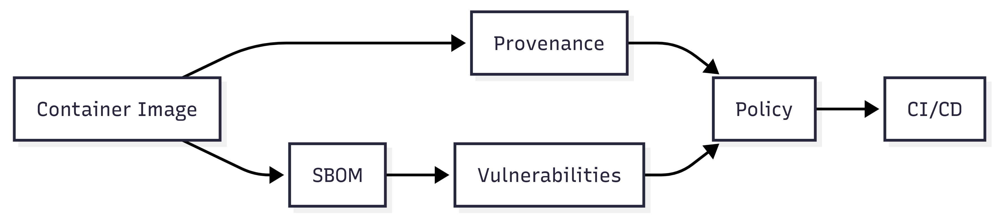

*A practical journey through images, provenance, SBOMs, vulnerabilities, and CI enforcement*

---

## Introduction

Containers have become the universal unit of software delivery. We pull images, deploy them to production, and trust that what we’re running is what we intended to run.

That trust is often implicit.

This blog documents my journey building a **container supply-chain validator** in Go — a tool that doesn’t just *scan* images, but **decides whether they should be allowed into CI/CD pipelines**.

Along the way, I learned far more about container internals, provenance, SBOMs, and vulnerability data than I expected. This document captures those learnings, with code snippets and practical trade-offs.

---

## Part 1 — Why Container Supply-Chain Security Is Broken

Most container security today is reactive:

- scan an image once
- upload a report
- hope someone reads it

But modern software supply chains are:
- distributed
- automated
- dependency-heavy
- fast

Security tools that merely **report** are rarely enforced. What we need instead are **validators** — tools that can say *yes* or *no* in CI.

A validator answers questions like:
- *Was this image built by a trusted system?*
- *Do I know what’s inside it?*
- *Does it violate my risk policy?*

Everything in this project flows from that idea.

---

## Part 2 — What Is Actually Inside a Container Image?

Before you can validate images, you need to understand what an image really is.

A container image is not a tarball. It is a **content-addressed graph** made of:

- a **manifest** (what to fetch)
- a **config** (how to run it)
- a set of **layers** (filesystem changes)

Two kinds of digests matter:

### Compressed layer digest
- Used by registries
- Identifies the compressed blob
- Appears in the manifest

### Uncompressed layer digest (DiffID)
- Identifies the *filesystem contents*
- Appears in the image config
- Used to detect drift

If two images have the same DiffIDs **in the same order**, their effective filesystems are identical — even if they were distributed differently.

This distinction becomes critical later when reasoning about reproducibility and provenance.

---

## Part 3 — Provenance: Trusting How an Image Was Built

Provenance answers a simple question:

> *Who built this image, and how?*

Standards like **SLSA** and **in-toto** define a structured way to describe:
- the builder identity
- the source repository
- the build steps
- the materials used

Tools like `cosign` attach this information as **signed attestations** to images.

In my validator, provenance verification means:
- fetching attestations
- verifying signatures
- checking builder identity
- handling the very common case where *no attestations exist*

An important lesson here:
> **Absence of provenance is not an error — but it is a signal.**

---

## Part 4 — SBOMs: Making Software Transparent

An SBOM (Software Bill of Materials) is simply an **inventory**:
- packages
- versions
- ecosystems
- licenses

It does not say whether software is secure.
It says **what exists**, so decisions can be made.

I learned quickly that SBOMs vary wildly in format:
- CycloneDX
- SPDX
- Syft JSON

Rather than fight formats, I normalize everything into a stable internal model:

```go
type NormalizedPackage struct {
    Name     string
    Version  string
    Type     string
    PURL     string
}
```

Once normalized, everything downstream becomes simpler.

## Part 5 — Resolving SBOMs the Right Way

One misconception I had early on:

```text
Every image has an SBOM.
```
That is not true.

SBOMs are optional metadata. When they exist, they can come from multiple places.

My resolution strategy became:

1. Signed SBOM attestation (best)

2. Generate SBOM locally (fallback)

Trust matters more than convenience. So I explicitly track where the SBOM came from:

```go
type SourceType string

const (
    SourceAttestation SourceType = "attestation"
    SourceGenerated   SourceType = "generated"
)
```

A generated SBOM is useful — but it should never be confused with a signed one.

A key lesson here:

```text
SBOM provenance matters as much as SBOM content.
```
## Part 6 — Vulnerability Scanning with OSV

Once you have an SBOM, the natural next step is vulnerability scanning.

Instead of raw CVE feeds, I chose OSV because:

- it understands ecosystems

- it supports batch queries

- it handles version ranges correctly

The scanning flow is:

1. take normalized packages

2. construct OSV batch queries

3. map results back to packages

4. normalize severity

Example mapping:

```go
func cvssToSeverity(score float64) Severity {
    switch {
    case score >= 9.0:
        return Critical
    case score >= 7.0:
        return High
    case score >= 4.0:
        return Medium
    default:
        return Low
    }
}
```

Vulnerabilities are not lists — they are relationships between versions and contexts.

## Part 7 — Policy: Turning Findings into Decisions

Scanning without enforcement is theatre.

The validator enforces policy via simple rules:
```bash
--fail-on high

```
This means:

- allow low/medium issues

- block high/critical issues

I also added ignore files to handle false positives:

```yaml
ignore:
  - vulnId: OSV-2025-1234
    reason: "False positive in static binary"
```

A validator must be strict and usable.

## Part 8 — GitHub Actions Integration

Security tools only work if developers see them.

GitHub Actions provides two powerful mechanisms:

- annotations (inline PR feedback)

- exit codes (CI enforcement)

When policy fails, my tool:

- exits non-zero

- prints human-readable output

- emits GitHub annotations like:
```ruby
::error::CRITICAL vulnerability OSV-2025-1234 in openssl@3.0.2
```

This brings security feedback directly into pull requests — where it belongs.

Part 9 — What This Tool Does Not Solve

It’s important to be honest.

This validator does not:

- detect zero-days

- analyze runtime behavior

- guarantee absence of compromise

What it does provide is:

- transparency

- trust signals

- enforceable gates

Security is not perfection. It is **risk** reduction.

Part 10 — Lessons Learned Building Security Tooling in Go

A few hard-earned lessons:

- APIs change — design small interfaces

- Blank imports matter (hello, SQLite drivers)
```go
	_ "modernc.org/sqlite"

```


- Failure paths deserve as much design as success paths

```text
Security tooling is about judgment, not just code

```


Most importantly:

```text

Good security tools explain their decisions.
```
Conclusion

This project started as an experiment and turned into a full supply-chain validator:




- provenance verification

- SBOM resolution

- vulnerability scanning

- policy enforcement

- CI integration

More importantly, it changed how I think about containers:
not as blobs to deploy, but as artifacts to be justified.

If this series helps even one engineer think more clearly about trust in their pipeline, it has done its job.